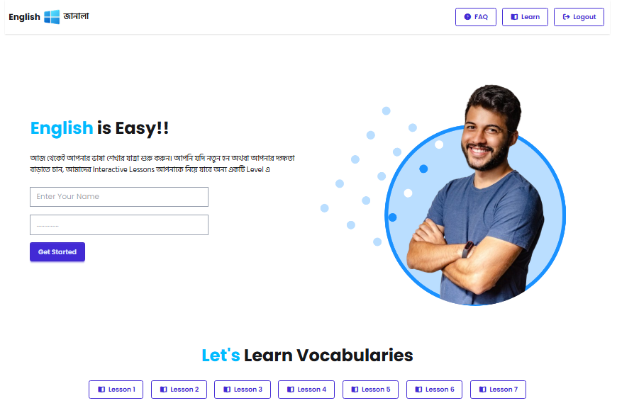
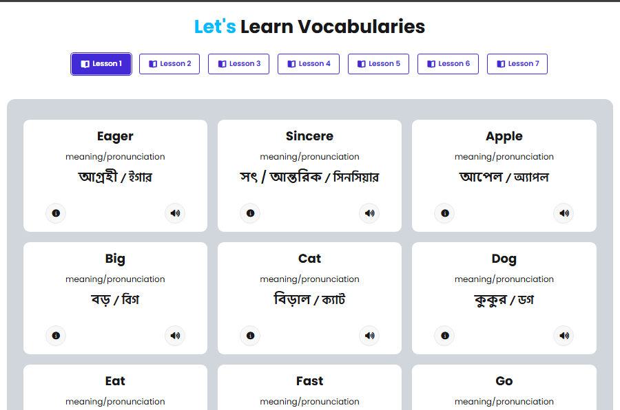
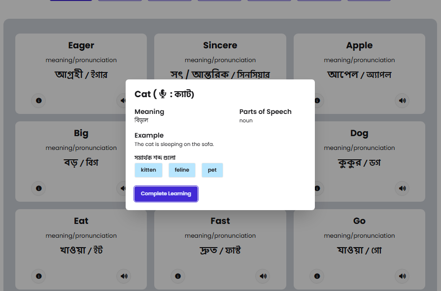

# 📘 English Janala | Vocabulary Learning App

A fully interactive **Vocabulary Learning Web Application** built with **HTML**, **JavaScript**, and **Tailwind CSS**.  
The app helps users learn vocabulary level-by-level, explore detailed word meanings, listen to pronunciations, search words, and save favorites.

---

## 🌐 Live Demo
> 🔗  For Live Link
 [Click Here](https://tirthorajmondal.github.io/English-Janala-html-css/)

---

## 📸 Screenshots

| Levels View                                     | Vocabulary Cards                               | Details Modal                                  |
| ----------------------------------------------- | ---------------------------------------------- | ---------------------------------------------- |
|  |  |  |

---

## 🚀 Features Overview

### 1️⃣ Show Levels on the UI
- Center-aligned heading based on **Figma design**
- Lesson buttons are **dynamically generated** 
- Lesson buttons load automatically on page load

---

### 2️⃣ Show Word Cards Based on Level
- Displays a **default instruction text** when no lesson is selected
- On clicking a lesson button:
  - Fetches vocabulary 
  - Displays words in **card format**
- Each card shows:
  - Vocabulary word
  - Meaning & pronunciation
  - Two action buttons with icons 
- Displays **“No Word Found”** message when a lesson has no data
- Active lesson button is visually highlighted

---

### 3️⃣ Active Level Button Styling
- After vocabulary loads successfully:
  - The active lesson button changes color
  - Helps users easily identify the selected level

---

### 4️⃣ Vocabulary Details Modal
- Clicking the **details icon** opens a modal
- Modal data is fetched 
- Modal displays:
  - Word with pronunciation
  - Example sentence
  - Synonyms
- Includes a **“Complete Learning”** button to close the modal

---

### 5️⃣ Handling Invalid or Missing Data
- Avoids rendering falsy values (`null`, `undefined`)
- Displays fallback text such as:
  - “No example available”
  - “No synonyms found”

---

### 6️⃣ Loading Spinner ⏳
- Displays a loading spinner while data is being fetched from APIs
- Improves UX during asynchronous operations

---

### 7️⃣ Search Functionality 🔍
- Includes a search input field
- Filters vocabulary dynamically as the user types
- Resets active lesson button when search is performed

---

### 8️⃣ Save Word Feature ❤️
- Each vocabulary card includes a **heart icon**
- Clicking it saves the word to a **Saved Section**
- Saved words are displayed separately for quick access

---

### 9️⃣ Speak Your Vocabularies 🔊
- Users can listen to correct pronunciation
- Uses **JavaScript Speech Synthesis API**
- Triggered by clicking the sound icon

---

## 🛠️ Technologies Used

- **HTML5**
- **JavaScript (ES6+)**
- **Tailwind CSS**
- **REST APIs**
- **Web Speech API**

---

## 📂 Project Structure

```bash
📦 vocabulary-app
 ┣ 📂 assets
    ┗📂 screenshots
 ┣ 📜 index.html
 ┣ 📜 style.css 
 ┣ 📂 scripts
    ┗ 📜 index.js
 ┗ 📜 README.md
````

---

## ⚙️ How to Run Locally

1. Clone the repository

```bash
git clone https://github.com/tirthorajmondal/English-Janala-html-css.git
```

2. Navigate into the project folder

```bash
cd English-Janala-html-css
```

3. Open `index.html` using:

* Live Server (recommended)
* Or directly in your browser

---

## 🎯 Key Learnings

* DOM manipulation with vanilla JavaScript
* API integration & async data handling
* Conditional rendering
* State management without frameworks
* Tailwind CSS utility-first styling
* UX enhancements (spinner, modals, feedback)

---

## 🚧 Future Improvements

* Persist saved words using `localStorage`
* User authentication
* Progress tracking per lesson
* Pagination for large vocab lists
* Mobile-first optimizations

---

## 👨‍💻 Author

Built with ❤️ by **Tirtho Raj Mondal**

